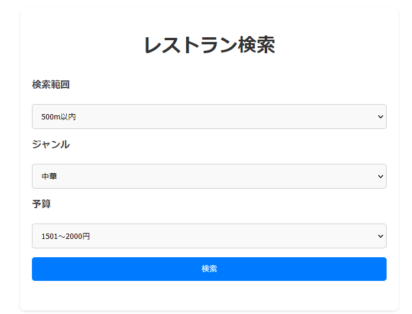
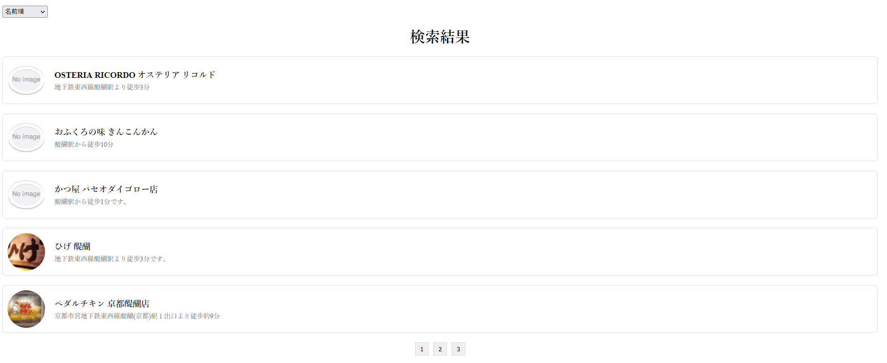

# 簡易仕様書サンプル

### 作者
戸田悠太
### アプリ名
近くでみつけるレストランサーチ

#### コンセプト
検索条件にあわせよりより店舗を検索、選択できる。

#### こだわったポイント
飲食店の検索条件を検索範囲、ジャンル、予算と絞り込め探しやすいように 
検索結果にソート機能を追加してアクセスが近い順や評価順に並び替えることが可能 
自分が使い手だとするとどんな機能が欲しいか考え実装するようにした 

### 該当プロジェクトのリポジトリ URL
https://github.com/dropow/feltask

## 開発環境
### 開発環境
vscode

### 開発言語
Laravel Framework 10.44.0
Vue.js　3.4.19

## 開発期間
5日間

## アプリケーション機能
###1,レストラン検索 
ホットペッパーグルメサーチAPIを使用して現在地周辺の飲食店を検索する 
検索条件機能:範囲、ジャンル、予算で細かく指定することができる 
検索結果がなければ検索結果がなかったとポップアウトで表示 

### 結果表示 
検索条件に応じて結果を画面に一覧として表示する 
フィルタ機能:検索結果を名前順、アクセス順、評価順と並び替えることができる 

### 詳細表示 
検索結果で表示された店の詳細が表示 
アクセス、住所、営業時間、平均予算など必要な詳細がわかる 

### ページネーション機能
1ページに5つまでの店舗情報が表示されそれ以上はページがわけられる。
-------------------------------------------------------------

### 画面一覧
- 検索画面 ：条件を指定してレストランを検索する。
- 一覧画面 ：検索結果の飲食店を一覧表示する。
- 詳細画面 :店舗の詳細な画面が表示される。

### 使用しているAPI,SDK,ライブラリなど
- ホットペッパーグルメサーチAPI
- GeolocationAPI

### デザイン面で子だわったポイント
ユーザーがみやすく使いやすいように意識してデザイン

### 自己評価
今まで触ったことがなかった新しい技術に挑戦でき完成させることができた。

### アドバイスして欲しいポイント
さらに追加した方がいいと考える機能。よりよいものを作るにあたり取り入れるべき技術や知見があれば教えていただきたいです。
